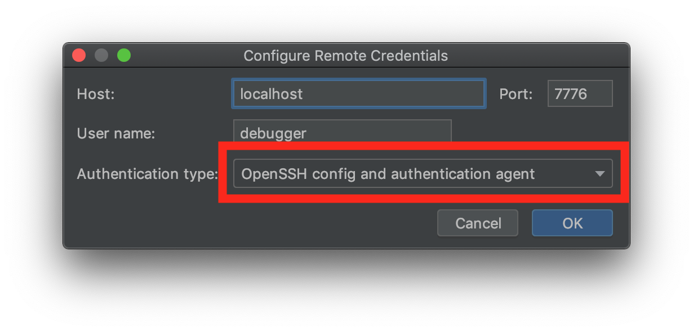

# Pure only remote configuration Dockerfile

## About it

This help you make remote debugging environment with docker. You can make your own remote development environment using your current docker image. This Dockerfile make only ssh configulation.

requirements

- docker image for develop
- ssh key under ~/.ssh (this copy automatically)

## How to use

## usage

1. edit 1st line in `Dockerfile`

```
FROM amd64/gcc:latest -> your/development:image
```

2. build and start container

```
docker-compose up -d
```

3. configure IDE

Almost all is same as original, but ssh configuration is changed as following.



# Debugging C++ in a Docker Container with CLion

> Note: Source code is modified from [Cornell CS 5450 course material](
https://pages.github.coecis.cornell.edu/cs5450/website/assignments/p1/docker.html).

> **Update December 2018:** this repository has been updated after the Clion 2018.3 release, which adds native remote debugging support.
Check out the [official guide](https://blog.jetbrains.com/clion/2018/09/initial-remote-dev-support-clion/) It makes a debugger's life much easier. HOORAY!

This repository provides a minimal C++ project setup and the Dockerfile that
allows developers to debug code in a Docker container using JetBrain Clion IDE.

Debugging in a container has many benefits, especially if you are developing
Linux applications on OS X.

+ It allows a consistent environment for both development and deployment;
+ Developers are free from installing dependencies on their development
machine. Some packages cannot be easily installed on OS X.
+ The container can be launched on your development machine, or on a remote server.

## Introduction

All application code, as well as its dependencies, will be installed, compiled, and ran within the container.
Then, we launch a `gdbserver` to allow remote debugging outside of the container.

Clion supports remote debugging feature since [2018.3](https://blog.jetbrains.com/clion/2018/09/initial-remote-dev-support-clion/).

The container has a long running ssh server process, such that the container can
be placed on a remote host.

> The container exposes 2 ports. 7777 is for `gdbserver` connection. 22 for the
ssh server. To avoid trouble when the container is launched on the development
machine, the container 22 port is mapped to host 7776 port. This can be changed
to any arbitrary number in `docker-compose.yml`.

## Prerequisites

On your development machine, you must have a CLion IDE (2018.3 or above) installed,

On the host machine of your container (which can be the development machine),
the latest Docker CE installation would be sufficient.

## Usage

To debug the example, follow the following steps. If you have any problem, please refer to the [official tutorial](https://blog.jetbrains.com/clion/2018/09/initial-remote-dev-support-clion/) before opening an issue.

0. Import the project into CLion using the provided `CMakeLists.txt`.

0. Build the container.

    ```bash
    docker build -t liuempire/docker_clion_dev .
    ```

0. Launch the container with `docker-compose`.

    ```bash
    docker-compose up -d
    ```
    After this step, the container is running with an ssh server daemon. Clion will automatically run/test/debug via an ssh connection. The folder where `docker-compose.yml` locates will be the mapped to `/home/debugger/code` within the container. CLion will *not* use this mapped directory.

0. Configure the container toolchain in Clion. Go to ***Settings/Preferences | Build, Execution, Deployment | Toolchains***, configure the container as a remote host. The username is `debugger`. The password is `pwd`. The completed configurations should be similar to the following: 

0. Configure the container CMake settings in CLion. Go to ***Settings/Preferences | Build, Execution, Deployment | CMake***, add a container CMake profile:

0. Check the file mapping settings in Clion. Before each run, code will be `rsync`-ed to the container at a temporary location. The following configuration should be generated automatically after the previous two steps:

0. In your Clion, you should be able to select `Debug-Local container` in before execution.

0. Add breakpoints in Clion. Happy debugging!

To stop the container, run `docker-compose down`.

## Customization

+ Add dependency installation scripts to `Dockerfile`.
+ Replace `CMakeLists.txt` with your customized project `CMakeLists.txt`.
